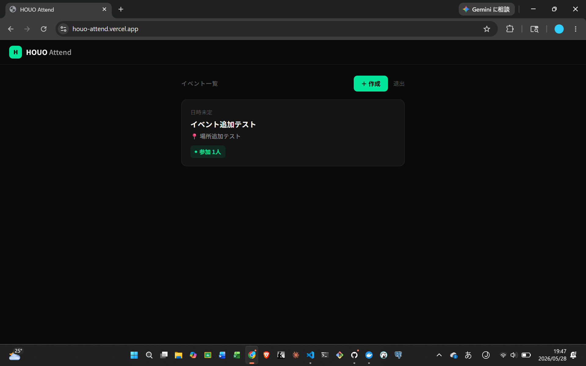

# HOUO Attend

**法桜交流会（ほうおうこうりゅうかい）専用のイベント出欠管理Webアプリ**

🔗 **[https://houo-attend.vercel.app](https://houo-attend.vercel.app)**



---

## 制作背景

私が設立した日本大学法学部の学生団体「法桜交流会（ほうおうこうりゅうかい）」では、イベントの出欠確認をLINEのテキストで行っており、参加人数の把握に手間がかかっていました。  
「10秒で出欠を登録できる」をコンセプトに、団体専用のシンプルな出欠管理アプリをフルスタックで自作しました。

## 機能

- 団体コードによる入場認証（メンバー / 管理者）
- イベントの作成・編集・削除
- 出欠登録（参加 / 不参加 / 未定）・備考入力
- 出欠回答の編集・削除
- 参加者フィルタリング（全員 / 参加 / 不参加 / 未定）
- LINEでのイベント共有
- 管理者によるコード変更

## 技術スタック

| レイヤー | 技術 |
|---------|------|
| フロントエンド | Next.js 14 (App Router) |
| バックエンド | FastAPI + SQLAlchemy 2.0 |
| データベース | PostgreSQL (Neon) |
| 認証 | JWT (python-jose) |
| インフラ | Vercel / Render / Neon |
| 開発環境 | Docker Compose |

## ローカル開発

### 前提条件

- Docker / Docker Compose

### セットアップ

```bash
git clone https://github.com/Taiyo-Tanabe/HOUO-Attend-Code.git
cd HOUO-Attend-Code

cp .env.example .env
# .env を編集してコードや秘密鍵を設定

docker compose up --build
```

| サービス | URL |
|---------|-----|
| フロントエンド | http://localhost:3001 |
| バックエンド API | http://localhost:8001 |
| PostgreSQL | localhost:5433 |

### 環境変数 (`.env`)

| 変数名 | 説明 |
|-------|------|
| `POSTGRES_DB` | DB名 |
| `POSTGRES_USER` | DBユーザー |
| `POSTGRES_PASSWORD` | DBパスワード |
| `MEMBER_CODE` | メンバー用入場コード |
| `ADMIN_CODE` | 管理者用入場コード |
| `JWT_SECRET` | JWT署名鍵（`python -c "import secrets; print(secrets.token_hex(32))"` で生成） |
| `CORS_ORIGINS` | 許可するオリジン（カンマ区切り） |
| `NEXT_PUBLIC_API_URL` | バックエンドのURL |

## 本番デプロイ

```
Vercel (Next.js)  →  Render (FastAPI)  →  Neon (PostgreSQL)
```

**1. Neon** — プロジェクト作成後、接続文字列（`postgresql://...?sslmode=require`）を控える

**2. Render** — Web Service としてこのリポジトリを接続
- Root Directory: `backend`
- Build Command: `pip install -r requirements.txt`
- Start Command: `uvicorn main:app --host 0.0.0.0 --port $PORT`
- 環境変数: `DATABASE_URL` `JWT_SECRET` `MEMBER_CODE` `ADMIN_CODE` `CORS_ORIGINS`

**3. Vercel** — このリポジトリを接続
- Root Directory: `frontend`
- 環境変数: `NEXT_PUBLIC_API_URL` にRenderのURLを設定

## ライセンス

MIT
